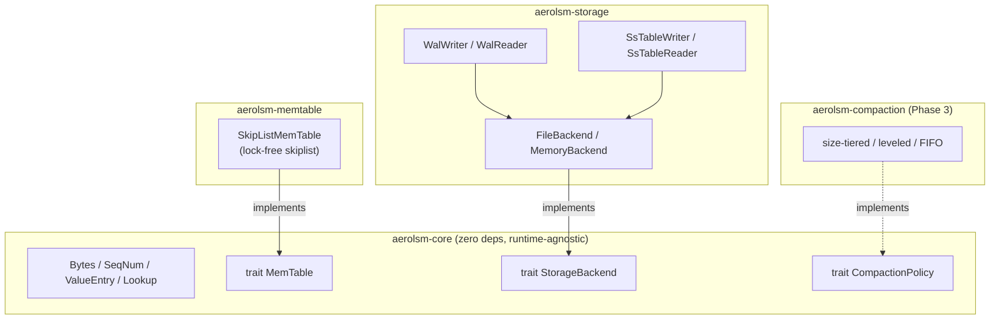

# AeroLSM

**A pure-Rust, fully asynchronous, lock-free Log-Structured Merge-Tree, built for the AI era.**

[CI](https://github.com/aerolsm/aerolsm/actions/workflows/ci.yml)
[License: MIT OR Apache-2.0](#license)
[Rust: 1.85+](#)


---

AeroLSM is a storage engine designed from a blank page for the workloads that
define the AI era: the ultra-high-concurrency read/write cycles of **AI-agent
memory state** and **vector metadata**. Legacy engines were built for a
synchronous, single-writer, disk-bound world. AeroLSM is built for thousands of
concurrent async tasks mutating small keys with minimal contention.

> **Status: Phase 2.** WAL, portable storage backends, and SSTable writer/reader
> are implemented. Compaction and the engine orchestration layer land in Phase 3.

## Why AeroLSM?

- **Async & zero-copy first.** The engine is asynchronous to its core. Keys and
values flow as reference-counted `[Bytes](crates/core/src/types.rs)` so the same allocation is shared
between the MemTable, iterators, and (soon) SSTable blocks without copying. The
storage seam is shaped for `io_uring` on Linux.
- **Lock-free, not lock-light.** The default MemTable is a hand-written lock-free
skiplist: writes link nodes with a single CAS, reads are wait-free traversals,
and there is no global write lock. It is engineered for many concurrent
writers.
- **Pluggable everything.** Storage backends, MemTables, and compaction
strategies all live behind small, well-documented Rust traits. Swapping an
implementation never touches the engine core.
- **No database dependencies.** Every primitive is built from scratch. There is
no `sled`, `rocksdb`, or `leveldb` under the hood - and the lock-free MemTable
uses no `crossbeam`, no `rand`, just `std`.
- **Contributor-obsessed.** Pristine `#![deny(missing_docs)]` documentation,
runnable examples on every public type, `rustfmt`/`clippy` enforced in CI, and
a modular workspace so you can land a meaningful PR in an afternoon.

## Architecture

AeroLSM is a Cargo workspace of small, focused crates. The core crate defines the
contracts; sibling crates provide the implementations.




| Crate                | Description                                | Status      |
| -------------------- | ------------------------------------------ | ----------- |
| `aerolsm-core`       | Core types and the pluggable trait surface | Stable seam |
| `aerolsm-memtable`   | Default lock-free skiplist `MemTable`      | Implemented |
| `aerolsm-storage`    | `StorageBackend`, WAL, SSTable I/O         | Implemented |
| `aerolsm-compaction` | `CompactionPolicy` strategies              | Phase 3     |


## Quickstart

Add the pieces you need (path/git dependencies for now; crates.io once 0.1 ships):

```toml
[dependencies]
aerolsm-core = { git = "https://github.com/aerolsm/aerolsm" }
aerolsm-memtable = { git = "https://github.com/aerolsm/aerolsm" }
```

Share one MemTable across an entire async runtime:

```rust
use std::sync::Arc;
use aerolsm_core::{Bytes, Lookup, MemTable};
use aerolsm_memtable::SkipListMemTable;

#[tokio::main]
async fn main() -> aerolsm_core::Result<()> {
    let memtable = Arc::new(SkipListMemTable::new());

    // Fan out writes across many concurrent tasks - no locks, no contention point.
    let mut tasks = Vec::new();
    for agent in 0..1_000u64 {
        let mt = Arc::clone(&memtable);
        tasks.push(tokio::spawn(async move {
            let key = Bytes::from(format!("agent:{agent}:state"));
            mt.insert(key, Bytes::from("thinking"), agent + 1).await
        }));
    }
    for t in tasks {
        t.await.unwrap()?;
    }

    assert_eq!(memtable.len(), 1_000);
    assert_eq!(
        memtable.get(b"agent:7:state").await?,
        Some(Lookup::Found(Bytes::from("thinking"))),
    );

    // A delete is a tombstone: "deleted" is distinguishable from "never written".
    memtable.delete(Bytes::from("agent:7:state"), 10_000).await?;
    assert_eq!(memtable.get(b"agent:7:state").await?, Some(Lookup::Deleted));

    Ok(())
}
```

## How the lock-free MemTable works

A truly lock-free skiplist normally requires epoch-based reclamation to free
nodes that other threads might still be traversing. AeroLSM sidesteps that
entirely by leaning on a property of LSM MemTables: **they are insert-only**.

- A "delete" inserts a tombstone value; nodes are never unlinked.
- Overwriting a value swaps an atomic pointer and *retires* the old value onto a
lock-free stack.
- The whole table is dropped at once on flush - and `Drop` has exclusive access,
so every allocation is freed in a single safe pass.

The result: lock-free inserts and wait-free reads with **zero reclamation
machinery during the table's lifetime**. The unsafe core is small, isolated to
one module, and carries a safety comment on every `unsafe` operation. See
`[crates/memtable/src/skiplist.rs](crates/memtable/src/skiplist.rs)`.

## Roadmap

- [x] **Phase 1** - Workspace foundation, core traits, lock-free skiplist MemTable
- [x] **Phase 2** - Write-Ahead Log + portable `StorageBackend` + SSTable writer/reader
- [ ] **Phase 3** - Pluggable compaction (size-tiered, leveled), manifest
- [ ] **Phase 4** - `io_uring` backend, pluggable compression
- [ ] **Phase 5** - MVCC snapshots, vector-metadata-aware access paths

## Contributing

AeroLSM is built to be extended. The fastest way in is to pick a trait and write
an implementation. See [CONTRIBUTING.md](CONTRIBUTING.md) for the architecture
tour and the local dev workflow.

## License

Licensed under either of [Apache License, Version 2.0](LICENSE-APACHE) or
[MIT license](LICENSE-MIT) at your option. Unless you explicitly state
otherwise, any contribution intentionally submitted for inclusion in the work by
you, as defined in the Apache-2.0 license, shall be dual licensed as above,
without any additional terms or conditions.